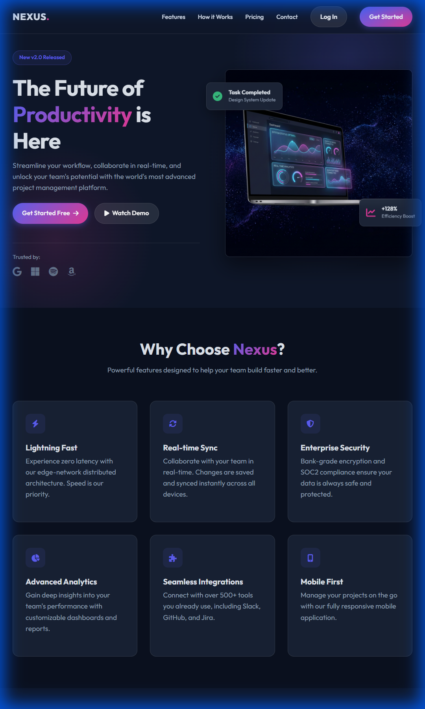

# Nexus Product Landing Page

A modern, high-converting landing page designed for "Nexus", a fictional next-generation productivity platform. This project demonstrates a premium tech aesthetic with a focus on user experience and responsiveness.



## 🚀 Features

- **Modern Aesthetic**: Dark mode theme featuring glassmorphism, vibrant gradients, and neon accents.
- **Responsive Design**: Fully fluid layout that adapts seamlessly from desktop to mobile devices.
- **Interactive Elements**:
  - Smooth scrolling navigation
  - Scroll-triggered reveal animations
  - Mobile hamburger menu
  - Hover effects and micro-interactions
  - **Floating "Go to Top" Button**: Smoothly scrolls back to the top of the page.
- **Comprehensive Sections**:
  - **Hero**: 3D dashboard mockup and clear CTA.
  - **Features & Benefits**: Grid layouts and alternating content blocks.
  - **Pricing**: 3-tier pricing table with monthly/yearly toggle.
  - **Contact**: Functional-looking form and contact details.

## 🛠️ Technologies Used

- **HTML5**: Semantic structure and accessibility.
- **CSS3**: Custom properties (variables), Flexbox, Grid, and media queries. No frameworks used.
- **JavaScript**: Vanilla JS for navigation logic, scroll animations, and interactivity.
- **Font Awesome**: Scalable vector icons.
- **Google Fonts**: 'Outfit' typeface for a modern, clean look.

## 📂 Project Structure

```
landing_page/
├── img/
│   ├── hero_dashboard_mockup.png  # Generated hero image
│   ├── desktop_preview.png        # Desktop screenshot
│   ├── mobile_preview.png         # Mobile screenshot
│   ├── pricing_preview.png        # Pricing section screenshot
│   ├── contact_preview.png        # Contact section screenshot
│   └── scroll_top_preview.png     # Scroll to top button screenshot
├── index.html                     # Main HTML file
├── style.css                      # Custom styles
├── script.js                      # Interaction logic
└── README.md                      # Project documentation
```

## 📦 How to Run

1. Clone the repository or download the source code.
2. Open the `index.html` file in any modern web browser.
3. Enjoy the experience!

## 🎨 Design Highlights

- **Hero Section**: Features a split layout with a compelling value proposition and a floating 3D visual.
- **Glassmorphism**: Used on cards and navigation to create depth and hierarchy.
- **Gradients**: Strategic use of Indigo (`#6366f1`) and Pink (`#ec4899`) to guide user attention.
- **Mobile First**: Optimized for touch devices with appropriate sizing and spacing.

---

© 2024 Nexus Inc. All rights reserved.
